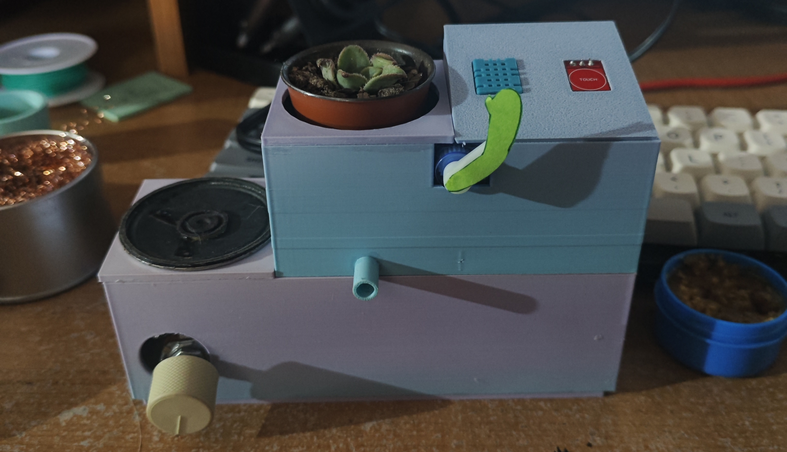
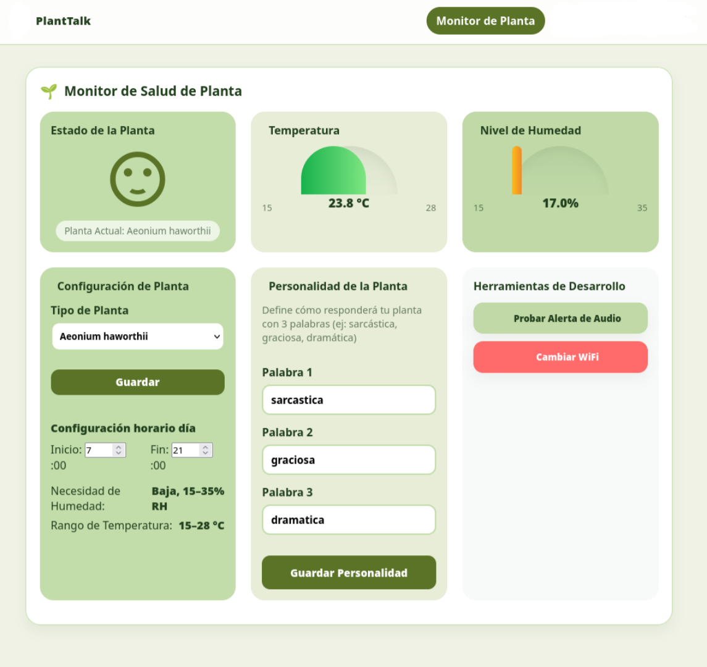
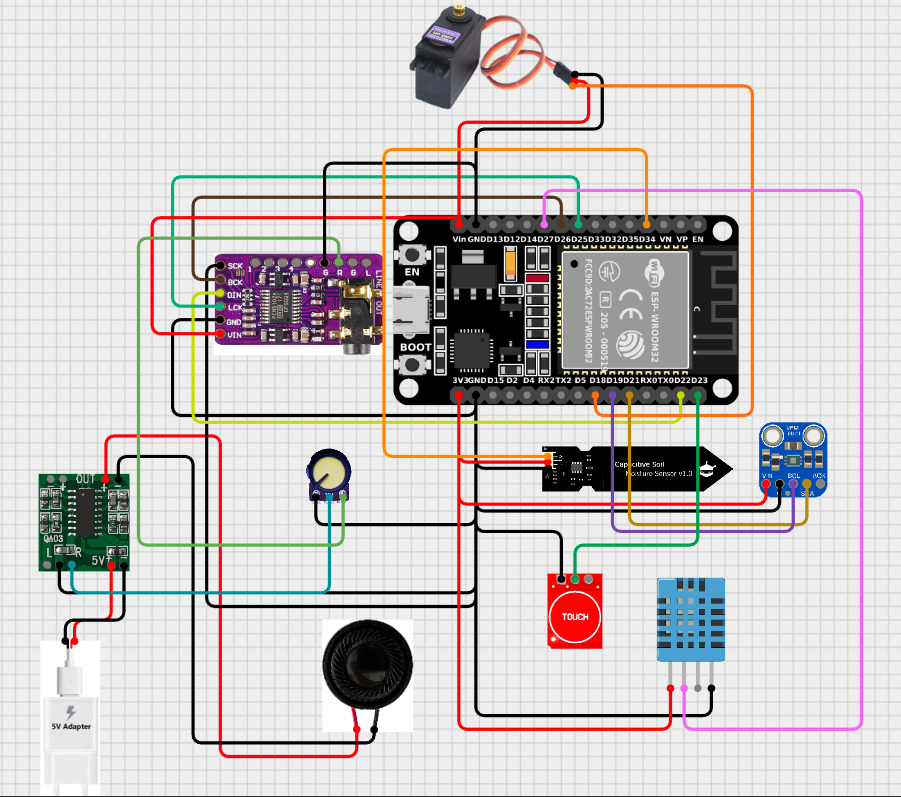
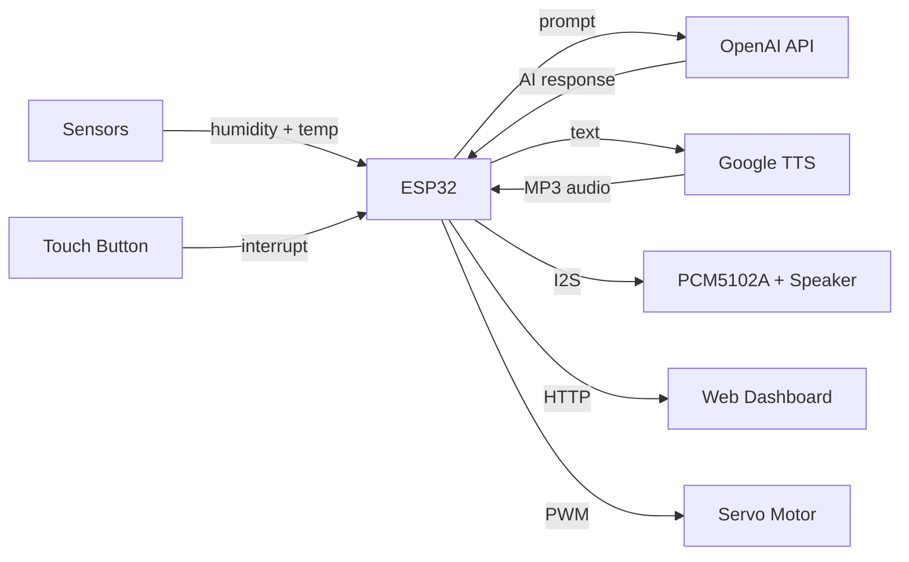
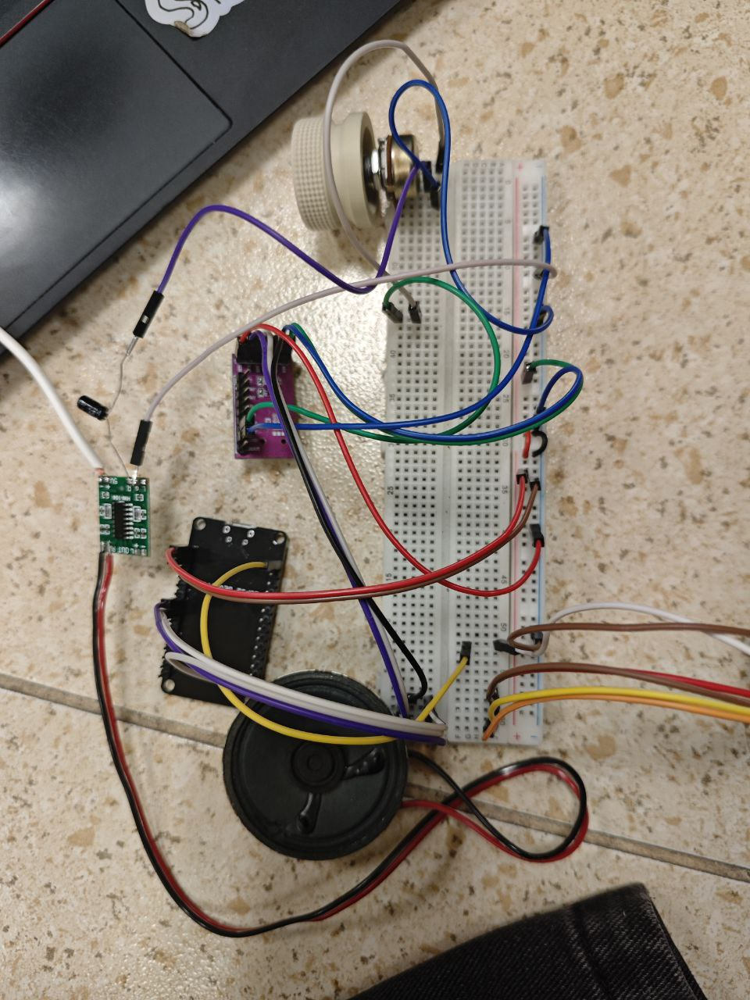
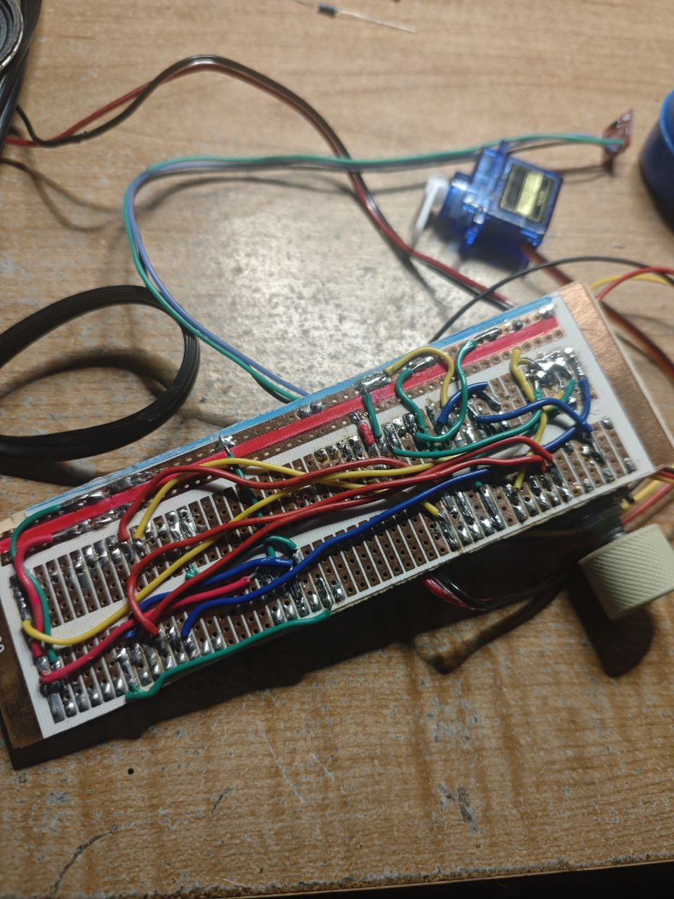
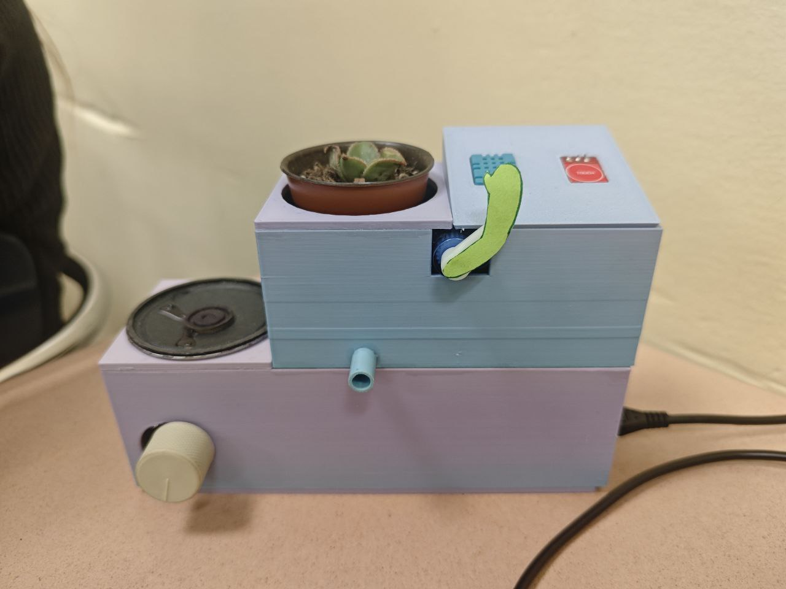

<p align="center">
  
</p>

<h1 align="center">PlantTalk</h1>

<p align="center">
  <b>An IoT talking plant powered by ESP32, AI and love</b>
</p>

<p align="center">
   
  
  
  
</p>

---

## What is PlantTalk?

PlantTalk is an IoT project based on an ESP32. Using sensors, peripherals and modules, it lets you take care of a plant that **literally speaks and tells you what it needs** — water, warmth, or just some attention.

The plant reads real-time soil moisture and temperature, sends the data to OpenAI to generate a response with a customizable personality, and speaks it out loud through a DAC speaker using Google TTS. It also has a web dashboard to monitor everything from your phone.

<p align="center">
  
</p>

---

## Features

- **AI-powered voice** — Generates unique responses using GPT-4o-mini with a 3-word customizable personality (e.g. *sarcastic, funny, dramatic*)
- **Text-to-Speech** — Speaks out loud through a PCM5102A DAC using Google TTS
- **Real-time monitoring** — Soil moisture (capacitive sensor) + ambient temperature (DHT11)
- **Web dashboard** — Beautiful responsive UI served from the ESP32 itself; accessible from any device on the local network
- **Touch interaction** — Single press: the plant talks. Double press: says hello and waves with a servo
- **Smart alerts** — Automatic voice alerts when humidity or temperature go out of range
- **Multiple plant profiles** — Presets for lavender, thistle, clover, aeonium, or custom ranges
- **WiFi auto-config** — Uses WiFiManager; no need to hardcode credentials
- **Persistent settings** — All configuration saved to flash memory (survives reboots)

---

## Demo

<p align="center">
  
</p>

---

## Hardware

### Components

| Component | Purpose | Pin |
|---|---|---|
| **ESP32 DevKit** | Main microcontroller | — |
| **PCM5102A DAC** | I2S audio output (speaker) | BCK: 26, WS: 25, DO: 22 |
| **Capacitive Soil Moisture Sensor** | Measures soil humidity | GPIO 34 (ADC) |
| **DHT11** | Measures ambient temperature | GPIO 27 |
| **Touch Button** | User interaction | GPIO 32 |
| **SG90 Servo Motor** | "Greeting" wave animation | GPIO 18 |
| **Speaker (3W–5W)** | Audio output | Connected to DAC |
| **5V Power Supply** | Powers the system | USB / external |

### Wiring Diagram

<p align="center">
  
</p>

<p align="center">
  <a href="https://app.cirkitdesigner.com/project/6a9ebe00-a32d-40bc-888a-b0e277cb8c26">View full wiring diagram</a>
</p>

---

## How It Works



1. **Sensors** read soil moisture and ambient temperature every 10 seconds
2. When the **button is pressed** (or conditions go out of range), the ESP32 builds a prompt with the sensor data
3. The prompt is sent to **OpenAI GPT-4o-mini**, which generates a short response matching the plant's personality
4. The response text goes to **Google TTS**, which returns an MP3 audio file
5. The audio is played through the **PCM5102A DAC** connected to a speaker
6. The **web dashboard** shows live sensor data and lets you configure the plant type, personality, and schedule

---

## Build Process

<p align="center">
  <table>
    <tr>
      <td></td>
      <td></td>
    </tr>
  </table>
</p>
<p align="center">
  
</p>

---

## Getting Started

### Prerequisites

- [Arduino IDE](https://www.arduino.cc/en/software) (2.x recommended) or [PlatformIO](https://platformio.org/)
- **ESP32 Arduino Core 2.0.14** — Install via Boards Manager: *Tools → Board → Boards Manager → search "esp32" → install version 2.0.14*
- An [OpenAI API key](https://platform.openai.com/api-keys)

### Required Libraries

Install these from the Arduino Library Manager or PlatformIO:

| Library | Version | Purpose |
|---|---|---|
| `WiFiManager` | — | Auto WiFi configuration portal |
| `ArduinoJson` | — | JSON parsing for API responses |
| `ESP8266Audio` | **1.0.7** | MP3 decoding and I2S audio output |
| `ESP32Servo` | — | Servo motor control |
| `DHT sensor library` | — | DHT11 temperature sensor |

### Installation

1. **Clone the repository**

```bash
git clone https://github.com/pepinisillo/PlantTalk.git
cd PlantTalk
```

2. **Configure your credentials**

Open `PlantTalkCodigo.ino` and replace the placeholders:

```cpp
const char* ssid = "WIFI_SSID";          // Your WiFi network name
const char* password = "WIFI_PASSWORD";    // Your WiFi password
const char* openai_api_key = "OPENAI_API_KEY"; // Your OpenAI API key
```

> **Note:** Never push your real credentials to GitHub. Keep them only in your local copy.

3. **Upload to ESP32**

- Select board: **ESP32 Dev Module** (tested with ESP32 Arduino Core **2.0.14**)
- Select the correct COM port
- Click **Upload**

4. **Connect to the dashboard**

- Open the Serial Monitor (115200 baud) to see the assigned IP address
- Open that IP in your browser (e.g. `http://192.168.1.100`)

### First-time WiFi Setup

If the ESP32 can't connect to WiFi, it creates a hotspot called **`PlantTalk-Setup`**. Connect to it from your phone and configure your WiFi credentials through the portal.

---

## Configuration

From the **web dashboard** you can configure:

| Setting | Description |
|---|---|
| **Plant type** | Lavender, Thistle, Clover, Aeonium, or Custom |
| **Custom ranges** | Set your own humidity and temperature thresholds |
| **Personality** | 3 words that define how the plant talks (e.g. *sarcastic, funny, dramatic*) |
| **Day schedule** | Start and end hours for daytime (affects alert frequency) |

---

## Pin Reference

```
ESP32 GPIO Map — PlantTalk
─────────────────────────────
GPIO 18  →  Servo Motor (PWM)
GPIO 22  →  PCM5102A DIN (I2S Data Out)
GPIO 25  →  PCM5102A LCK (I2S Word Select)
GPIO 26  →  PCM5102A BCK (I2S Bit Clock)
GPIO 27  →  DHT11 (Temperature)
GPIO 32  →  Touch Button (INPUT_PULLUP)
GPIO 34  →  Soil Moisture Sensor (ADC)
```

---

## Project Structure

```
PlantTalk/
├── PlantTalkCodigo.ino   # Main source code (ESP32 firmware)
├── images/               # Photos and screenshots for documentation
│   ├── banner.png
│   ├── final-build.jpg
│   ├── web-dashboard.png
│   ├── wiring-diagram.png
│   ├── build-01.jpg
│   ├── build-02.jpg
│   └── case-final.jpg
├── .gitignore
└── README.md
```

---

## Tech Stack

<p align="center">
  
  
  
  
  
  
</p>

---

<p align="center">
  
  <i>"If you smile everyday and live happily from now on, then that's enough"</i><br/>
  <b>— Yuuichirou Hyakuya</b>
</p>
